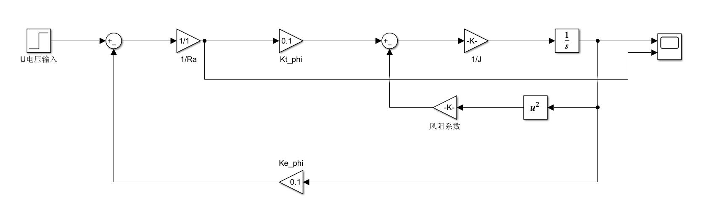
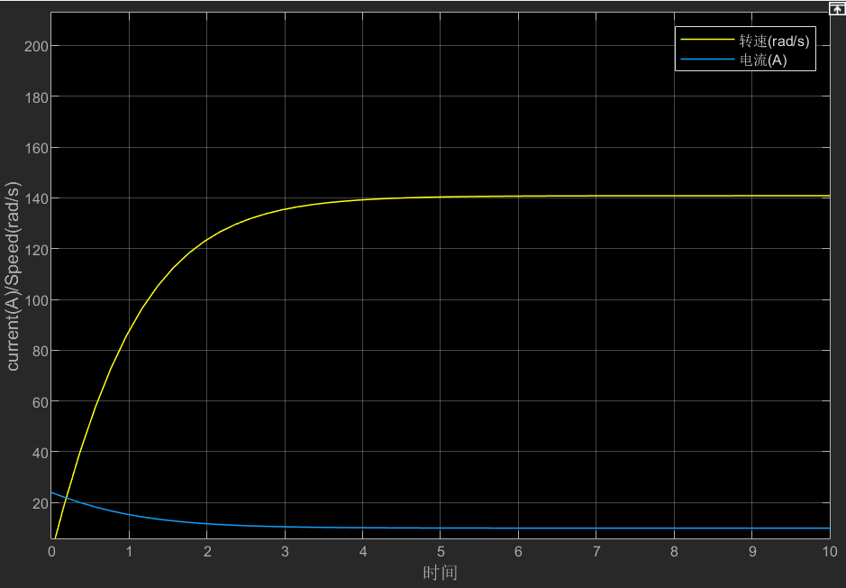

# DC-motor-simulink-dynamics
基于Matlab/Simulink的直流他励电机机电传动仿真，包含恒转矩与风机非线性负载动力学对比分析
本项目基于 Matlab/Simulink 搭建了直流他励电机的机电传动系统数学模型。通过精确的控制回路连线，对比并分析了电机在“恒转矩突变扰动”与“风机类非线性负载（风力矩）”两种典型场景下的运行稳定性与响应特性。

---

## 1. 系统数学方程与拓扑架构

本仿真严格遵循机电传动控制的核心物理方程，并在系统中设置了以下标准仿真参数：
- **电枢电阻**： $R_a = 1\ \Omega$
- **转动惯量**： $J = 0.02\ \text{kg}\cdot\text{m}^2$
- **转矩/反电动势系数**： $K_t\Phi = K_e\Phi = 0.1$

### 核心物理方程：
- 电枢回路方程： $$I_a = \frac{U - E}{R_a}$$ （其中反电动势 $E = K_e\Phi \cdot \omega$）
- 动力学运动方程： $$T - T_L = J \frac{\mathrm{d}\omega}{\mathrm{d}t}$$ （其中电磁转矩 $T = K_t\Phi \cdot I_a$）

### 仿真模型拓扑图
**（1）恒转矩负载响应模型图**
**（2）风机类平方负载响应模型图**

> **建模细节说明**：利用 Math Function 模块，将最右端输出的角速度进行平方运算，并配合增益系数，构建了负载转矩的实时非线性反馈回路。

---

## 2. 核心实验场景与波形对比

实验统一采用恒定输入电压 U = 24V，总仿真时间为 10 秒。

### 场景 A：恒转矩负载响应（传统工业场景）

- **动态现象**：0-2秒为空载启动阶段，转速飙升至理论极限 240 rad/s，电枢电流滑落至 0A。在 t=2s 时突加 0.5 N·m 的恒转矩负载，转速出现瞬时小幅下跌，随后依靠自身反电动势负反馈调节，在约 190 rad/s 处达到新平衡；电流同步自适应飙升至 5A 提供抗衡转矩。
- **实验结论**：完美验证了直流他励电机在恒转矩负载下具有极强的自动调节能力，系统绝对稳定。

### 场景 B：风机类平方转矩负载响应（真实风水阻力场景）

- **动态现象**：启动伊始，负载阻力即随转速呈平方级同步暴涨。由于强大的外部阻尼反馈提前介入，转速和电流波形非常平滑，不再出现突变拐点，系统响应明显加快，在约 **140 rad/s** 处极快地收敛并达到稳态平衡。

---

## 3. 稳态平衡点（140 rad/s）的理论数学对齐

根据场景 B 示波器反馈的真实数据，系统在 **140 rad/s** 达成完美能量守恒，其实际动力学推导如下：

1. **反电动势计算**： 
   $$E = K_e \cdot \Phi \cdot \omega = 0.1 \times 140 = 14\text{ V}$$
2. **电枢电流计算**： 
   $$I_a = \frac{U - E}{R_a} = \frac{24 - 14}{1} = 10\text{ A}$$
   *(该理论值与右图示波器中黄色电流最终稳定在 10A 的物理现实百分之百吻合！)*
3. **电磁转矩与风阻平衡**：
   - 电机输出动力转矩： $$T = K_t \cdot \Phi \cdot I_a = 0.1 \times 10 = 1\text{ N·m}$$
   - 外部风阻阻力转矩： $$T_L = k \cdot \omega^2 = 0.00005 \times 140^2 = 0.98\text{ N·m}$$
   
**核心工程总结**：电机的动力（1 N·m）与风阻阻力（0.98 N·m）在 140 rad/s 处几乎完全相等，加速度降为 0。风机负载由于“转速越高、阻力越大”的特性，虽然压低了最大输出转速，但其速度高阶负反馈为系统引入了极大的阻尼，使得过渡过程时间大大缩短。

---

## 4. 仿真环境
- Matlab/Simulink 2026 (或兼容版本)
- 基于信号流纯数学建模，未动用 Simscape 物理库，具备高计算效率。
