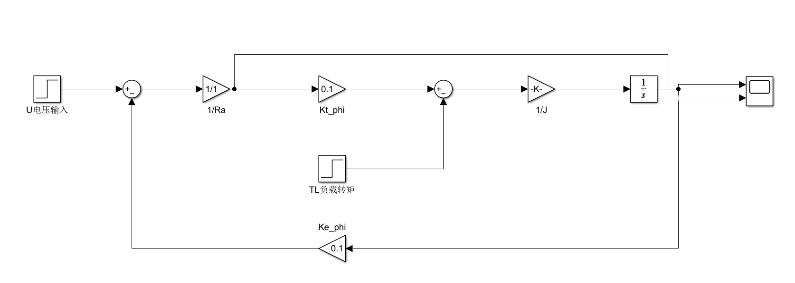
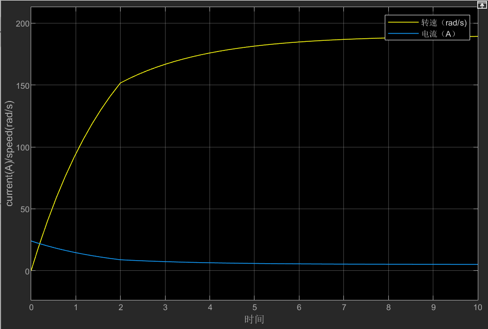

# DC-motor-simulink-dynamics
基于Matlab/Simulink的直流他励电机机电传动仿真，包含恒转矩与风机非线性负载动力学对比分析
本项目基于 Matlab/Simulink 搭建了直流他励电机的机电传动系统数学模型。通过对比实验，深度探究了系统在“恒转矩扰动”与“风机类非线性负载”下的稳定性与响应特性。

## 1. 系统数学模型
- 电枢回路方程： $I_a = \frac{U - E}{R_a}$
- 运动方程式： $T - T_L = J \frac{\mathrm{d}\omega}{\mathrm{d}t}$

## 2. 仿真拓扑结构 (风机类非线性负载)
  
*(注：利用 Math Function 模块构建了 $T_L = k\omega^2$ 的转速负反馈回路)*

## 3. 核心实验对比与动力学分析
实验设置：同一输入电压 $U=24\text{V}$，对比传统恒转矩负载与风机类负载（$k=0.00005$）的动态响应。

###  核心工程发现：
1. **稳态工作点转移**：在风机负载下，随着转速上升风阻呈平方级暴涨。系统最终在 210 rad/s 处达到“电磁转矩 = 风阻转矩”的全新平衡点，无法达到纯理论空载转速（240 rad/s）。
2. **阻尼效应与快速响应**：风机负载由于引入了速度高阶反馈，增加了系统的阻尼。相比恒转矩启动，风机负载系统达到稳态（曲线变平）的时间显著缩短。

## 4. 运行环境
- Matlab/Simulink 2026 (或兼容版本)
- 纯信号流建模，适合低算力平台快速验证。
